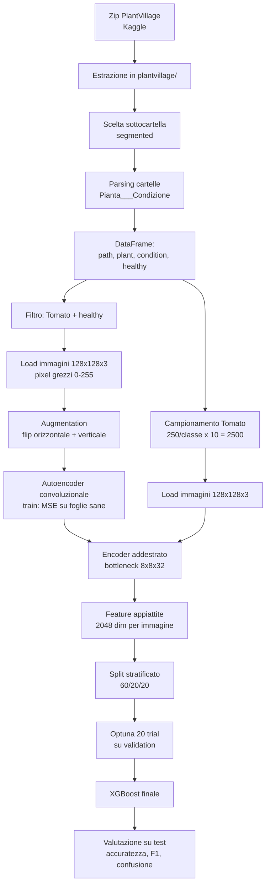

# Architettura della pipeline

Il progetto rileva e classifica le malattie delle foglie di **pomodoro** sul dataset
**PlantVillage**, combinando una componente non supervisionata (autoencoder) e una
supervisionata (XGBoost). Questo documento descrive il flusso E2E così com'è
implementato nel notebook `models/leaves_classifier.ipynb`.

> **Nota iniziale del progetto.** → Nasce inizialmente come rilevatore di anomalie localizzate sulle sole foglie di pomodoro, ma per decisioni progettuali si è tramutato in un classificatore di malattie (vedi [0002](decisioni/0002-autoencoder-vs-patchcore.md)). 
> L'autoencoder è addestrato solo su foglie sane, ma nel codice
> attuale il suo encoder viene usato **come estrattore di feature** per il classificatore.
> Il rilevamento delle anomalie tramite errore di ricostruzione **non è implementato**
> (vedi [decisioni/0007](decisioni/0007-encoder-feature-extractor.md) e
> [esperimenti.md](esperimenti.md)).

## Diagramma del flusso

## 1. Caricamento e parsing del dataset

- Se la cartella `plantvillage/` non esiste, il notebook cerca uno zip
  `plantvillage-dataset*.zip` e lo estrae (fonte: Kaggle `abdallahalidev/plantvillage-dataset`).
- Il dataset offre più varianti delle stesse immagini in sottocartelle (`color`,
  `grayscale`, `segmented`). Con `USE_SEGMENTED=True` viene selezionata la sottocartella
  **`segmented`** (foglie ritagliate su sfondo nero). Vedi
  [decisioni/0004](decisioni/0004-sottoinsieme-segmented.md).
- Le classi sono cartelle nominate `Pianta___Condizione`. `parse_class()` ricava
  `(pianta, condizione, sana)`: `healthy` → foglia sana, altrimenti nome della malattia.
- Risultato: **54.306 immagini, 14 specie, 21 condizioni** complessive. Il lavoro si
  concentra su `TARGET_PLANT = "Tomato"`, la specie con più malattie distinte
  (**10 condizioni**: 9 malattie + `healthy`).

## 2. Preprocessing

- Ogni immagine è letta in RGB, ridimensionata a `IMG_SIZE = 128` e mantenuta come
  array di **pixel grezzi in [0, 255]** di forma `(128, 128, 3)`, canali in ultima
  posizione (formato dei layer convoluzionali Keras).
- La normalizzazione **non** avviene qui: è delegata a un layer `Rescaling(1/255)`
  interno all'autoencoder, in modo che input e ricostruzione vivano nello stesso
  spazio di pixel `[0, 255]`.

## 3. Autoencoder convoluzionale

Backend Keras impostato su **torch** (`KERAS_BACKEND=torch`), vedi
[decisioni/0001](decisioni/0001-keras-torch.md).

**Encoder** (`name="encoder"`), risoluzione **128 → 64 → 32 → 16 → 8**:

| Layer | Uscita |
|---|---|
| `Rescaling(1/255)` | 128×128×3 |
| `Conv2D(32, 3, leaky_relu)` + `MaxPooling2D` | 64×64×32 |
| `Conv2D(64, 3, leaky_relu)` + `MaxPooling2D` | 32×32×64 |
| `Conv2D(128, 3, leaky_relu)` + `MaxPooling2D` | 16×16×128 |
| `Conv2D(128, 3, leaky_relu)` + `MaxPooling2D` | 8×8×128 |
| `Conv2D(32, 3, leaky_relu)` (bottleneck) | **8×8×32** |

**Decoder** (`name="decoder"`), simmetrico, risoluzione **8 → 16 → 32 → 64 → 128**:
blocchi `Conv2D(…, leaky_relu)` + `UpSampling2D` con canali `128 → 128 → 64 → 32`,
ultimo `Conv2D(3, 3, leaky_relu)` seguito da `Rescaling(255.0)` che riporta i pixel
in `[0, 255]`.

Il bottleneck è **convoluzionale** (mantiene la struttura spaziale 8×8) invece che denso:
vedi [decisioni/0005](decisioni/0005-bottleneck-convoluzionale.md). L'attivazione di
output è `leaky_relu`: vedi [decisioni/0006](decisioni/0006-attivazione-output-leaky-relu.md).

### Addestramento

- Dati: **solo foglie sane di pomodoro**, split 60/20/20.
  Augmentation con riflessioni orizzontale e verticale → **3.816** esempi di training.
  Input e target coincidono (l'autoencoder ricostruisce sé stesso).
- Compilazione: `Adam(learning_rate=5e-4, clipnorm=1.0)`, loss **`MeanSquaredError`**,
  metrica **`MeanAbsoluteError`**.
- Callback: `EarlyStopping(patience=8, restore_best_weights=True, monitor="val_loss")`
  e `ModelCheckpoint("ckpt/autoencoder.weights.h5", save_best_only=True)`.
- `epochs=100, batch_size=32`. In pratica l'addestramento si ferma dopo **64 epoche**
  (miglior `val_loss ≈ 187.7`, val MAE ≈ 6.8). Metriche dettagliate in
  [esperimenti.md](esperimenti.md).

## 4. Errore di ricostruzione e score di anomalia

Nel codice attuale **non è presente** il calcolo di uno score di anomalia dall'errore di
ricostruzione. Le costanti/funzioni predisposte a tale scopo (`TOPK_FRAC`, `gaussian_filter`)
sono importate/definite ma **non usate**. Della componente di ricostruzione
resta solo la verifica qualitativa `show_reconstructions()` (confronto originale vs ricostruita).

La conseguenza progettuale — usare l'encoder come estrattore di feature invece che come
rilevatore di anomalie pixel-based — è discussa in
[decisioni/0007](decisioni/0007-encoder-feature-extractor.md).

## 5. Classificazione con XGBoost

- **Feature.** Ogni immagine passa nell'encoder addestrato → bottleneck `8×8×32`,
  appiattito a un vettore di **2.048** valori (`encoder.predict(...).reshape(N, -1)`).
- **Campionamento.** Per il pomodoro si prendono `min(250, n)` immagini per condizione:
  10 classi × 250 = **2.500** esempi, etichette codificate con `LabelEncoder`.
- **Split.** Stratificato 60/20/20 → **train 1.500, val 500, test 500**.
- **Tuning.** `Optuna` (20 trial, ottimizzazione bayesiana) massimizza l'accuratezza sul
  validation. Spazio di ricerca: `max_depth [3,8]`, `learning_rate [0.01,0.3]` (log),
  `subsample [0.6,1.0]`, `colsample_bytree [0.6,1.0]`, `reg_lambda [1e-3,10]` (log).
- **Modello.** `XGBClassifier(n_estimators=600, eval_metric="mlogloss",
  early_stopping_rounds=20, tree_method="hist", device="cpu")`. Scelta CPU discussa in
  [decisioni/0008](decisioni/0008-optuna-xgboost-cpu.md).
- **Valutazione.** Accuratezza, `classification_report` (precision/recall/F1 per classe)
  e matrice di confusione sul test set. Risultati in [esperimenti.md](esperimenti.md).
